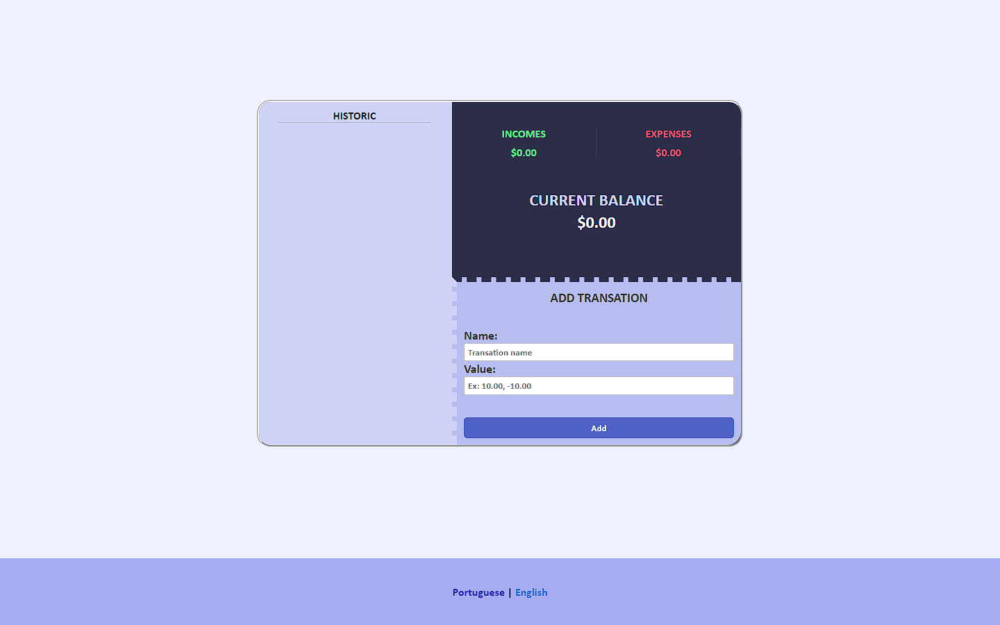
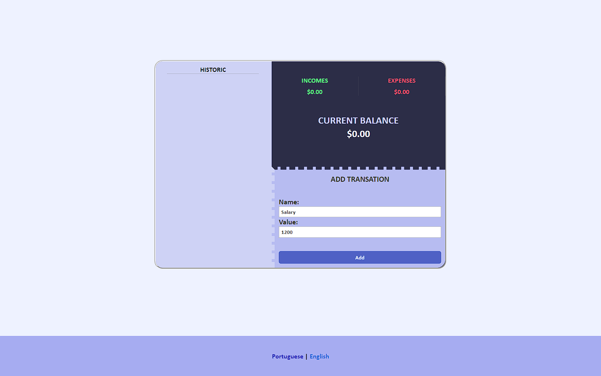
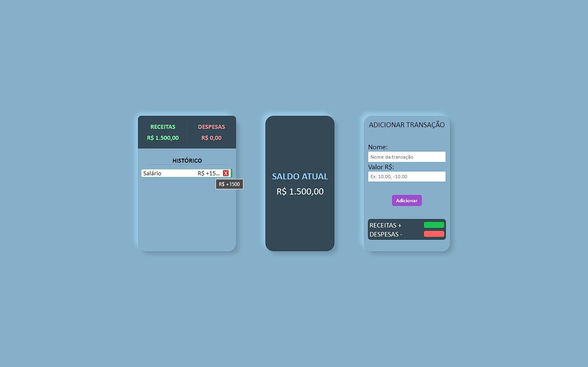
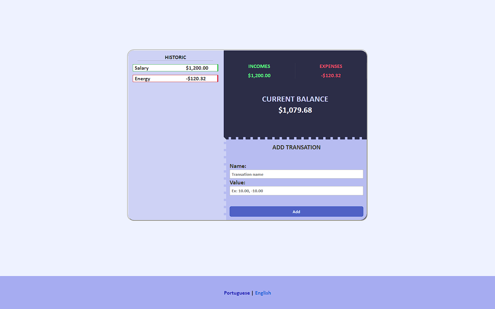

<h1>controle financeiro</h1>

<h2>O que faz?</h2>

O  usuário poderá gerenciar sua vida financeira, adicionando ou removendo fundos. O programa mostrará o total de receitas ganhas, total de despesas e a soma de ambas no total.

<h2>Como usar?</h2>

Para usar, basta escrever o nome da transação e o valor dela.

O valor será adicionado ao histórico da conta.

O saldo atual mostrará seu saldo sendo positivo ou negativo.

<h2>Linguagens usadas:</h2>

  
  
  

<h2>Projeto desenvolvido por mim (HTML e CSS) e <a href="https://github.com/breno05s">Breno Lourenço</a> (JavaScript).</h2>